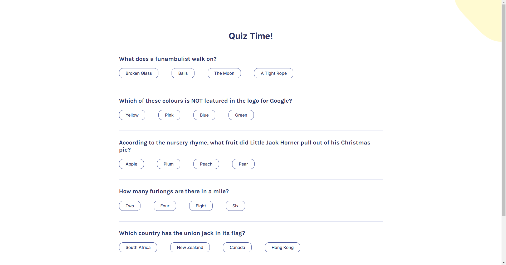

# Scrimba - Quizzical

This is a solution to the [Scrimba Learn React course solo project](https://scrimba.com/learn/learnreact). The ultimate React 101 - the perfect starting point for any React beginner.

## Table of contents

- [Overview](#overview)
  - [The challenge](#the-challenge)
  - [Screenshot](#screenshot)
  - [Links](#links)
- [My process](#my-process)
  - [Built with](#built-with)
  - [What I learned](#what-i-learned)
- [Author](#author)

## Overview

### The challenge

Users should be able to:

- See opening screen
- See quiz
- Select an answer
- Submit their selections
- Check their results

### Screenshot

### Links

- Solution URL: 
- Live Site URL: [Quizzical Live URL](https://quizzical-joelwebdev.netlify.app/)

## My process

### Built with

- Semantic Html
- Flexbox
- CSS Grid
- [React](https://reactjs.org/) - JS library
- [React Confetti](https://www.npmjs.com/package/react-confetti)

### What I learned

Learned the basics of modern React

## Author

- Website - [Joel Lopez](https://portfolio-v2-joelweb.netlify.app/)
- Github - [@yourusername](https://github.com/JoelLH)
